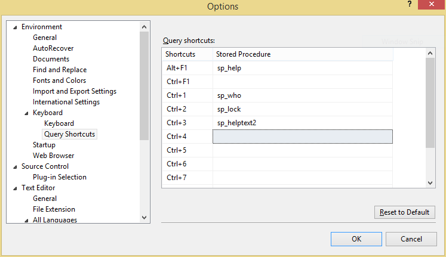
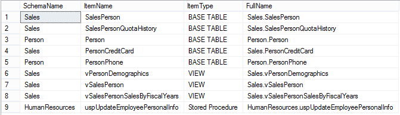
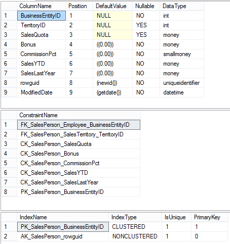
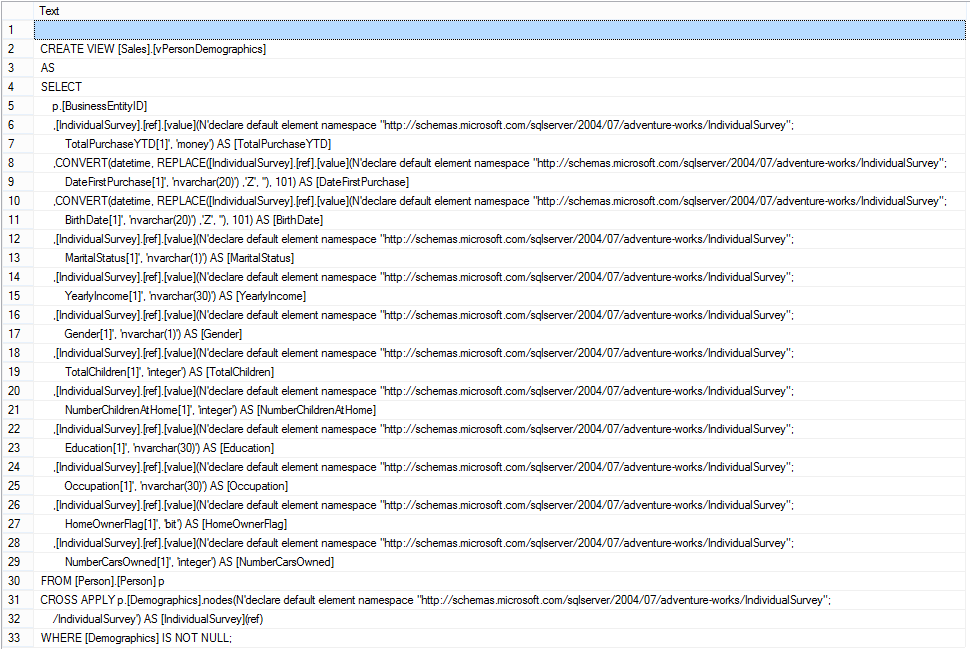

# sp_helptext2

> Identify information about the given text

## Script Purpose

This script will allow you to quickly do the following:
- Search your tables, views and stored procedures for specific text
- Display a stored procedure's definition
- View information about a table

## Getting Started

Run this script on your SQL Server. It will install itself in the master database. This will allow you to access the script from any database on the server.

Once the script is installed, you can execute the script like so:

```sql
exec dbo.sp_helptext2 'searchCriteria'
```

Replace the `searchCriteria` text with the the value you want to look up.

To make this even easier to use, you can install this as a query shortcut in your options menu. To do this, in SSMS open up the Options under the Tools menu. On the left, under Environment you will find a Keyboard section. When  you expand Keyboard you will see that it has two sub-sections. Select the second one, Query Shortcuts. On the right, you will see all of the shortcuts currently set up. Select an open one and put in `sp_helptext2`. Here is a screenshot of how that should look:




Now hit OK to close out the Options dialog. Now, when you open a new query window, you can just highlight a word and hit Ctrl+3 (if you put yours in that slot). This will execute the stored procedure and pass in the selected text as the query parameter.

## Examples

Let's look at how we could use this stored procedure to make life easier. All of the following examples are run against the AdventureWorks 2012 database from Microsoft.

### Partial Text Lookup

Maybe you are looking for an object and you know it has a specific term in the name. Maybe you are looking for all items with a given term in the name. In this example, I am looking for an object with the term `Person` in the title. Here is what I get back:



Notice that the items are sorted by type and that they have both their name and their schema name. The last column gives us the combined schema name and item name. This makes it easier to copy and paste from our results.

### Table Lookup

Taking the results from my partial text lookup, I decide that I want to see more information about the `Sales.SalesPerson` table. To do so, I simply copy the text from the `FullName` column into my query editor and then run the stored procedure again.

When I do, I get the following results:



This shows us what columns are in the table, including the name, default value, and type of each column. It also shows us the constraints on the table. In this case, we have foreign key constraints, check constraints and a primary key constraint. Finally, it shows us what indexes are on the table, including their type and if they are unique.

### View / Stored Procedure Lookup

Going back to our partial text lookup, maybe instead of a table, we actually want to look at a view. In this case, let's look at `Sales.vPersonDemographics`:



Note that we get a create statement for the view. The same would be true if we ran this against a stored procedure. Once we have the create statement, we can copy all of the lines and paste them into a new query window. Unlike the original `sp_helptext`, this will give us a clean version of the create statement without any extra line breaks.